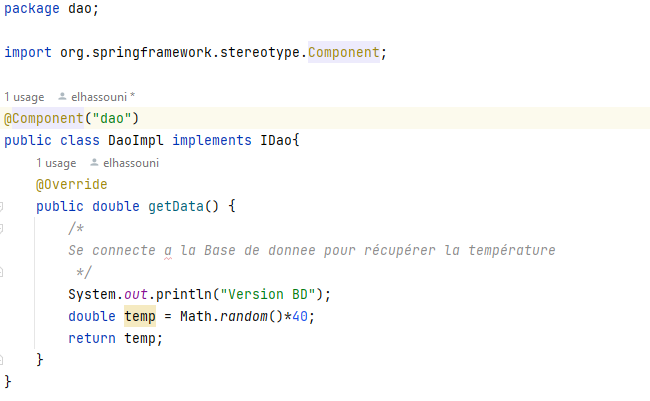

# COMPRE RENDU ( TP Application Java )
<h2 style="color:blue; ">Partie 1:</h2>

<h3>I- Création des Interfaces et Implémentations</h3>

  <h4 style="padding-left: 2em;" >1. IDao Interface</h4>

Création de l'interface IDao avec la méthode getDate.

            

<h4 style="padding-left: 2em;" >2. Implémentation de IDao</h4>

Développement d'une implémentation de l'interface IDao.

            

<h4 style="padding-left: 2em;" >3. IMetier Interface</h4>

Création de l'interface IMetier avec la méthode calcul.

            

<h4 style="padding-left: 2em;" >4. Implémentation de IMetier avec Couplage Faible</h4>

Implémentation de l'interface IMetier en utilisant le couplage faible.

            

<h4 style="padding-left: 2em;" >5. Implémentation d'Extension de l'Interface Dao</h4>

Creation de class DaoImpl2 (Capteur).

            

Creation de class DaoImplWS (Web Service).

            

<h3>II-  Injection des Dépendances</h3>

<h4 style="padding-left: 2em;" >1. Par Instanciation Statique</h4>

Mise en place de l'injection des dépendances par instanciation statique.

Version BD

            

Version Capteur

            

<h4 style="padding-left: 2em;" >2. Par Instanciation Dynamique</h4>

Réalisation de l'injection des dépendances par instanciation dynamique on utilisant un fichier txt.

config.txt

            

Test de injection des dépendances par instanciation  dynamique(Version BD).

            

On effectue un changement dans la premier ligne dans config.txt

            

Test de injection des dépendances par instanciation  dynamique(Version WS).

            

<h4 style="padding-left: 2em;" >3.  En Utilisant le Framework SpringXML</h4>

Configuration des beans et injection des dépendances via le fichier XML.

Fichier ApplicationContext.xml

            

Test de injection des dépendances par Framework SpringXML (Version Captures).

            

<h4 style="padding-left: 2em;" >4.  En Utilisant le Framework Spring Annotation</h4>

Utilisation des annotations de Spring pour la configuration et l'injection des dépendances.

Ajouter @Compenent a l'Implémentation de IDao DaoImpl.

            

Ajouter @Compenent et @Autowired a MartieImpl.

            

Dans test avant tous on choisir les packages des classes qu'on va utilise.

            

On peux aussi utilise constructeur.

            

Pour utilise differents extension on doit effectue les changement suivant :

Ajouter @Compenent a l'extention.

            

Ajouter @Qualifier a MartieImpl avec le nom d'extension (dans notre example DaoImpl2)

            

Dans test on ajouter le package ext aux packages des classes qu'on va utilise.

            

<h3>III- Test</h3>

<h4 style="padding-left: 2em;" >1. Class Calcul</h4>

Création de class Calcul avec la method somme.

            

<h4 style="padding-left: 2em;" >2. Tester la methode dans la partie test de maven</h4>

En utilise la methode assertTrue.

            

<h2>Conclusion</h2>

Pendant la réalisation de ce travail pratique, De nombreuses leçons significatives ont été extraites. Parmi les éléments essentiels à retenir :

<ul>
    <li>Couplage Faible et Flexibilité : L'utilisation du couplage faible dans l'implémentation de IMetier a illustré comment cette approche peut accroître la flexibilité et simplifier les modifications ultérieures.</li>
    <li>Injection des Dépendances avec Spring : Les différentes méthodes d'injection des dépendances, qu'il s'agisse de l'instanciation statique, dynamique ou via Spring, ont été explorées. Chacune présente ses avantages et inconvénients, le choix dépendant des besoins spécifiques du projet.</li> 
</ul>

<h3>Ressources</h3>
<ul>
    <li>Part 1 : https://www.youtube.com/watch?v=08eEhNKOw7I</li>
    <li>Part 2 : https://www.youtube.com/watch?v=oP-6ly2Zt5E</li>
</ul>

<h3>Auteur : </h3>
<h5>EL HASSOUNI Younes (19/02/2024)</h5>